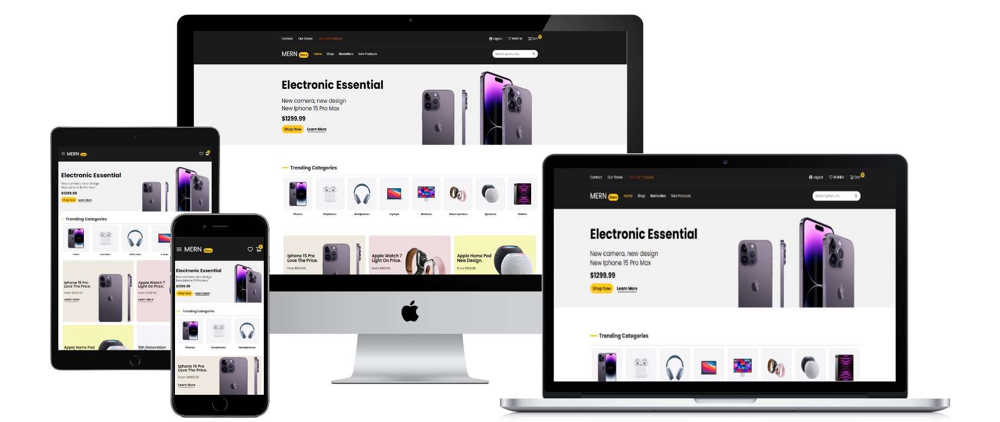
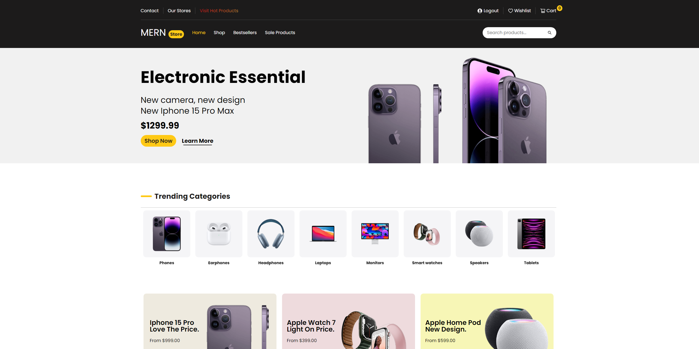
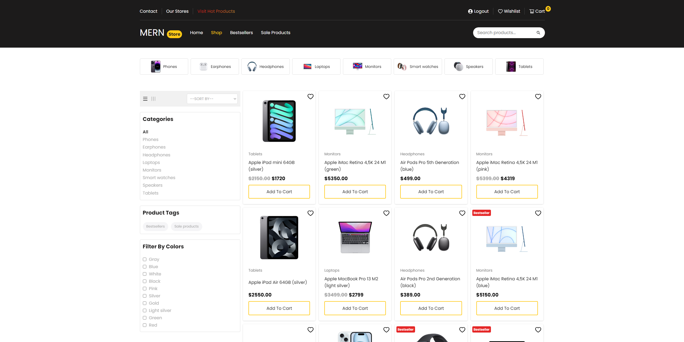
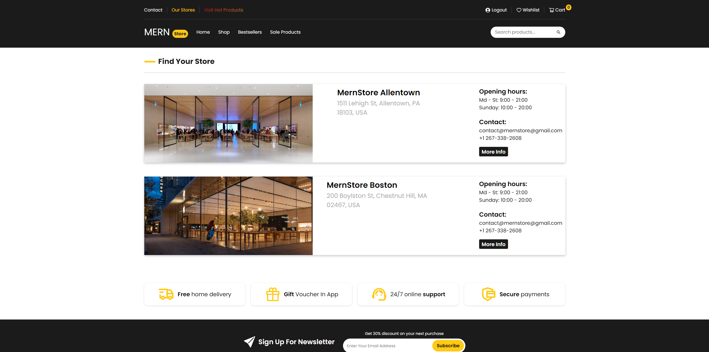
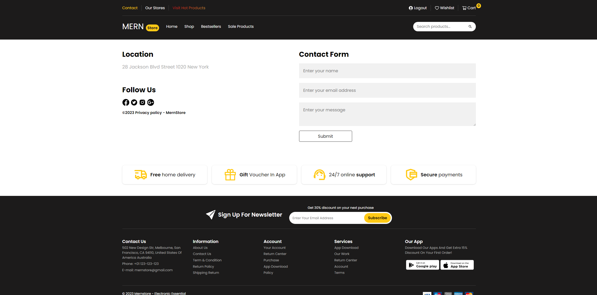
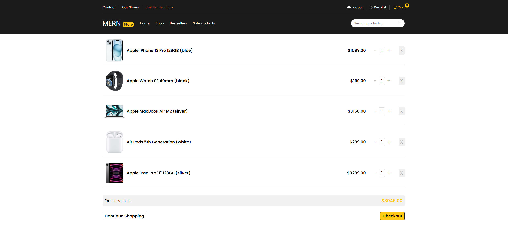
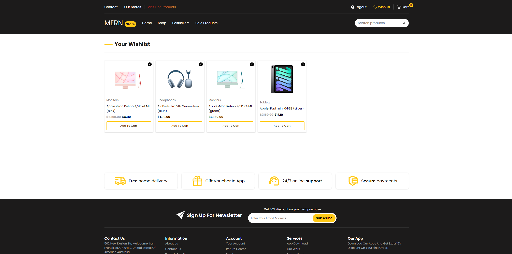
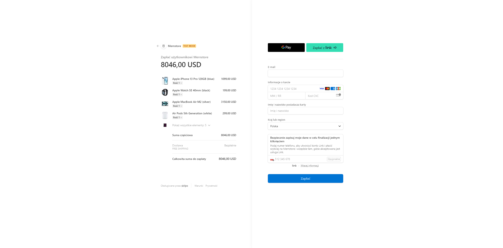
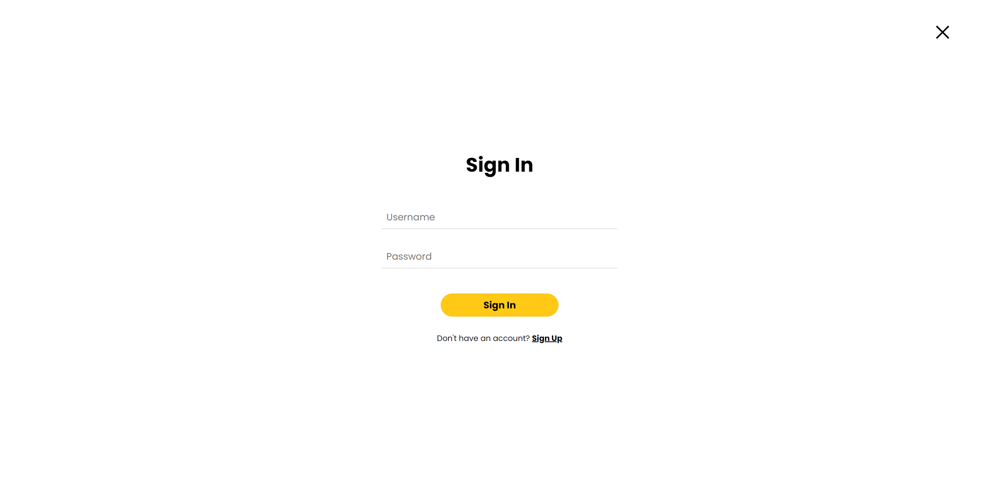

<h1>MernStore</h1>

<h2 style="margin-top: 50px">Introduction</h2>

The project was created with the goal of creating a responsive and modern online store that allows easy online shopping for electronics. The goal was to combine advanced technologies such as React, MongoDB and Stripe to create a comprehensive e-commerce platform.

<h2 style="margin-top: 50px">Screenshots</h2>

